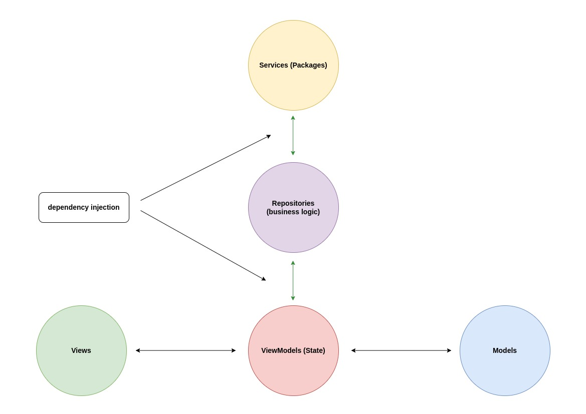
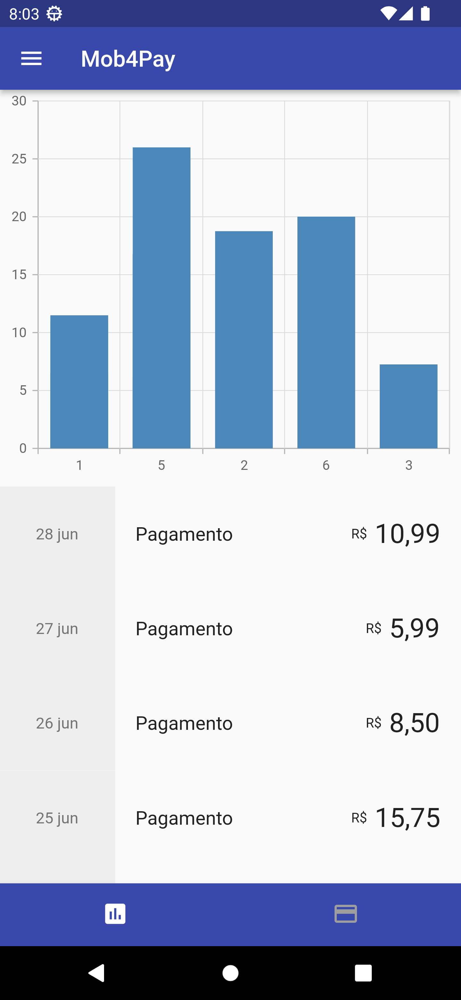
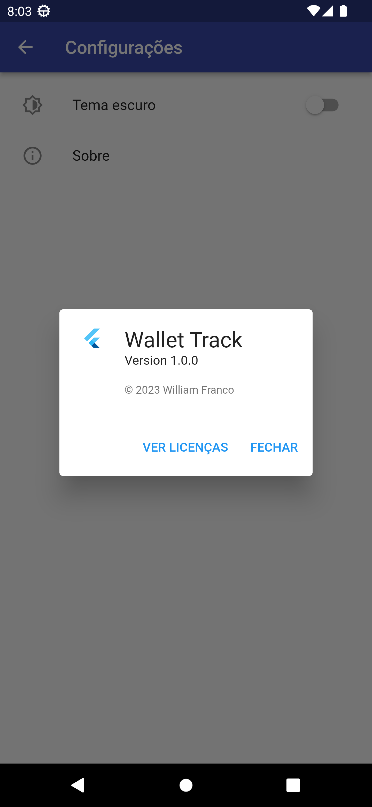
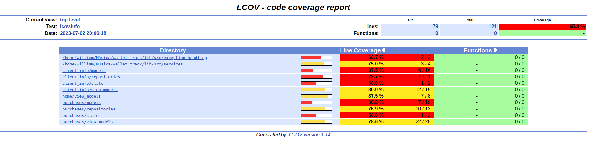

# Wallet Track

WalletTrack, gerencie compras e cartões em um só lugar. Acompanhe gastos, visualize histórico e simplifique sua vida financeira.


## About project

Esse projeto utiliza a abordagem feature first junto com a arquitetura MVVM e camadas de serviço e repositorio, como mostra a imagem a seguir: 



Usando essa abordagem na arquitetura MVVM com as camadas de Serviço e
Repositório, juntamente com a injeção de dependência, o código fica organizado e
modularizado. Isso ajuda a entender melhor o fluxo de dados e a responsabilidade de
cada camada no projeto, tornando o código mais fácil de entender e de manter.
Com a injeção de dependência, as dependências externas das camadas são
separadas, facilitando a implementação de testes automatizados. Além disso, essa
abordagem permite que novas funcionalidades sejam adicionadas facilmente sem
afetar outras partes do código, mantendo a escalabilidade do projeto.
A separação das camadas também ajuda a evitar a mistura de lógica de negócios com
a interface do usuário, o que leva a um código mais limpo e legível. Isso também ajuda
a evitar problemas de manutenção no futuro.


## ScreenShots

| Image 1 | Image 2 | Image 3 |
|----------|----------|----------|
|  |  |  |


## Coverage



```
flutter test --coverage

genhtml coverage/lcov.info -o coverage/html

open coverage/html/index.html
```


## License

MIT License

Copyright (c) 2023 William Franco

Permission is hereby granted, free of charge, to any person obtaining a copy of this software and associated documentation files (the "Software"), to deal in the Software without restriction, including without limitation the rights to use, copy, modify, merge, publish, distribute, sublicense, and/or sell copies of the Software, and to permit persons to whom the Software is furnished to do so, subject to the following conditions:

The above copyright notice and this permission notice shall be included in all copies or substantial portions of the Software.

THE SOFTWARE IS PROVIDED "AS IS", WITHOUT WARRANTY OF ANY KIND, EXPRESS OR IMPLIED, INCLUDING BUT NOT LIMITED TO THE WARRANTIES OF MERCHANTABILITY, FITNESS FOR A PARTICULAR PURPOSE AND NONINFRINGEMENT. IN NO EVENT SHALL THE AUTHORS OR COPYRIGHT HOLDERS BE LIABLE FOR ANY CLAIM, DAMAGES OR OTHER LIABILITY, WHETHER IN AN ACTION OF CONTRACT, TORT OR OTHERWISE, ARISING FROM, OUT OF OR IN CONNECTION WITH THE SOFTWARE OR THE USE OR OTHER DEALINGS IN THE SOFTWARE.
